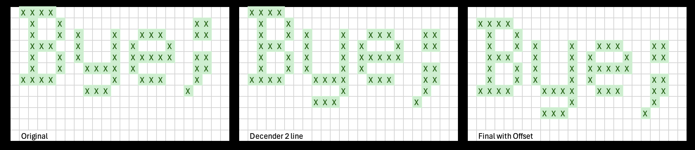
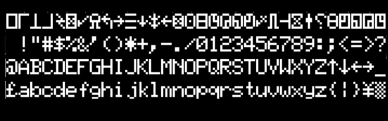
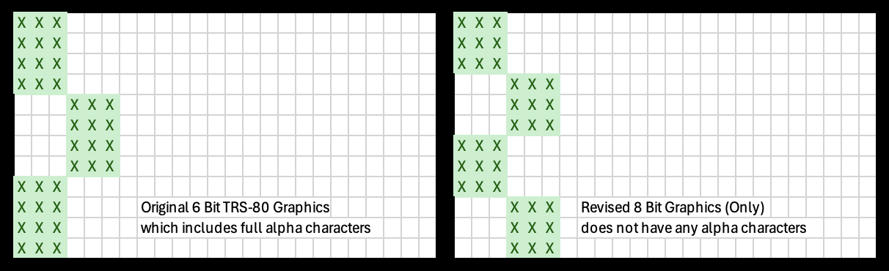

# Font Files

## Introduction

The following are some character generator fonts provided for use in the Model 1k project

Each font file is 4Kb (4,096 bytes) in length, and should be appended if writing
into a paged character generator ROM. 

The system can accept ROM of 128 to 512 kBit, affording between 4 and 16 fonts.

### Character Sets

Provided are six traditional TRS-80 font sets (including 2 derivatives).

These are documented here: 

[Character Generator Roms](https://github.com/RetroStack/Character_Generator_ROMs/tree/main/TRS-80%20Model%201/Individual)

In Summary:
* 06 - no duplicates, [ \ ] ^ ` ~
* 08 - no duplicates, ↑ ↓ ← → £/¥
* 14 - duplicates AZ, [ \ ] ^ ` ~
* 15 - duplicates AZ, ↑ ↓ ← → £/¥
* 17 - no duplicates, ↑ ↓ ← → ` ~ (derivative)
* 18 - duplicates AZ, ↑ ↓ ← → ` ~ (derivative)

In referance to Duplicates vs No Duplicates
* No Duplictaes - refers to the first 32 characters containing special Gliphs (see screenshots below)
* Duplicates - refers to the uppercase characters being duplicated into the first 32 characters of the font. 

Each font has 2 versions
* Original - Is the original font, converted to 4KB format, but otherwise unmodified.
* Final - Is a modified font with 2 line descenders, as per below.

The modified Final fonts have the following changes:
* The lower case characters  g j p q y  are stretched to have 2 line descenders
* The punctuation characters  . , : ;  moved vertically down for correct alignment.
* All characters are moved down by 1 pixel, leaving a blank first raster line

The following shows how these changes apply differences

In summary each character has 
* 1 leading blank raster line
* 7 lines for body of the character
* 2 line for descenders
* 2 trailing blank raster lines

ORIGINAL (example)

FINAL (example)

### GenDon3

This is an unmodified copy of "two" of the fonts provided by the GenDon3 hardware modification

* GenDon3-61 - I would suggest going with Dash 61 with the real underscore, for better ASCII compatibility.
* GenDon3-6A - (not provided) - has differences in the characters ' , ; V j m. The three punctuation marks are too far to the right, and the semicolon appears to be missing a pixel
* GenDon3-9E - The only difference between 9E and Dash 61 is that Dash 61 has a real underscore at the ASCII underscore code (95), where 9E has a four-line-high lump. They both have the lump at code 31

See The following discussion:

[GENDON3 improved character generator for the Model I](https://forum.vcfed.org/index.php?threads/gendon3-improved-character-generator-for-the-model-i-discussion.59498)

### Glens Stuff M1 Character Set

This is an unmodified copy (which is fully compatible) of the font file used in the following project

[Glens Stuff TRS-80 Clone](https://www.glensstuff.com/trs80/trs80.htm)

### Graphics 8 Bit Only Font

In a regular TRS-80 64 characters of the regular font are assigned to represent graphic pixels in a 2 x 3 matrix.
This gives a total of 6 pixels per character, each pixel utilises 3 horizontal and 4 vertical raster sub-pixels
The total screen resolution is 128 x 48

In this font, we assign all 256 characters to be graphics characters to render graphics in a 2 x 4 matrix 
This means each graphic pixel is a 3x3 actual raster pixels on the screen, with a total resolution of
128 x 64 pixels, a 33% improvement over stand trs-80 graphics

This is an experimental font, not much use at present as it contains no regular characters
In future a software controllable Bit to select this font is being implemented

One advantage would be existing software could easily make use of it, just need to redefine which character 
to write to the screen, and when to switch into and out of this new font, nothing much else changes.
The downsides is that you can't show any text characters on the screen at the same time.

