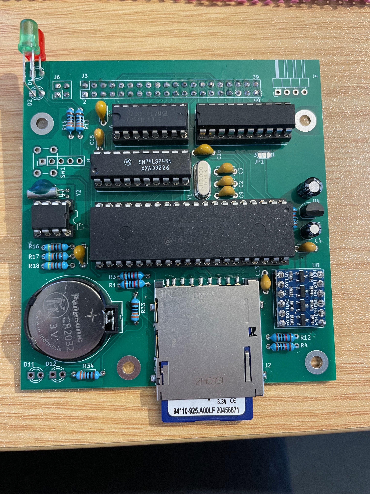
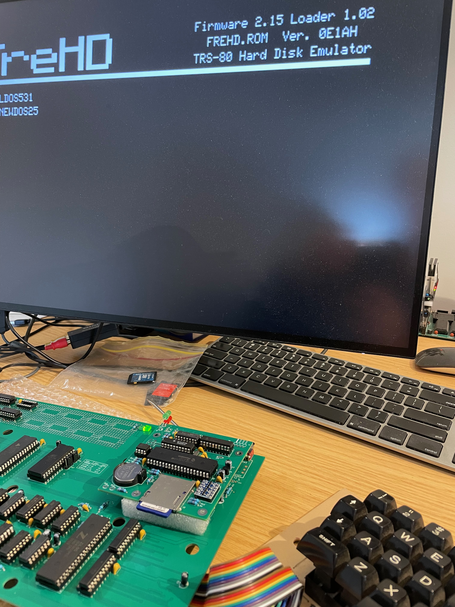
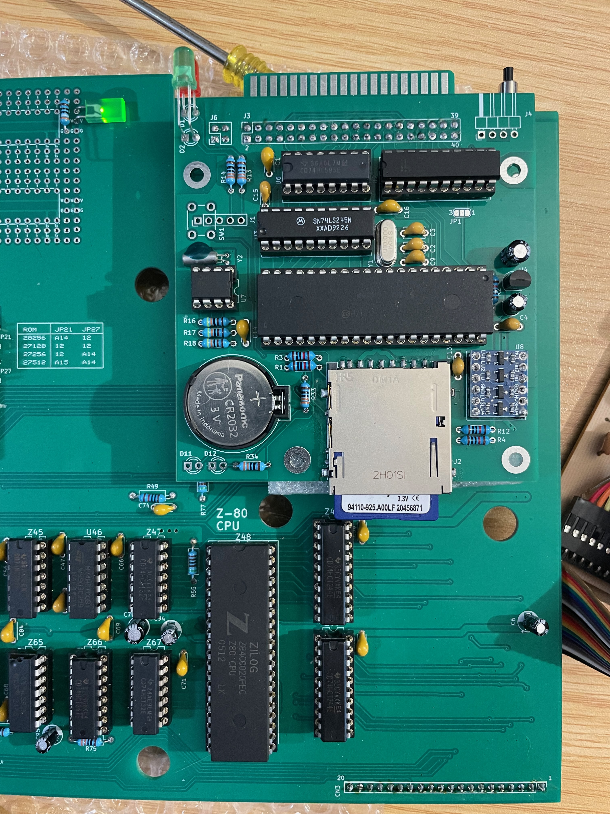
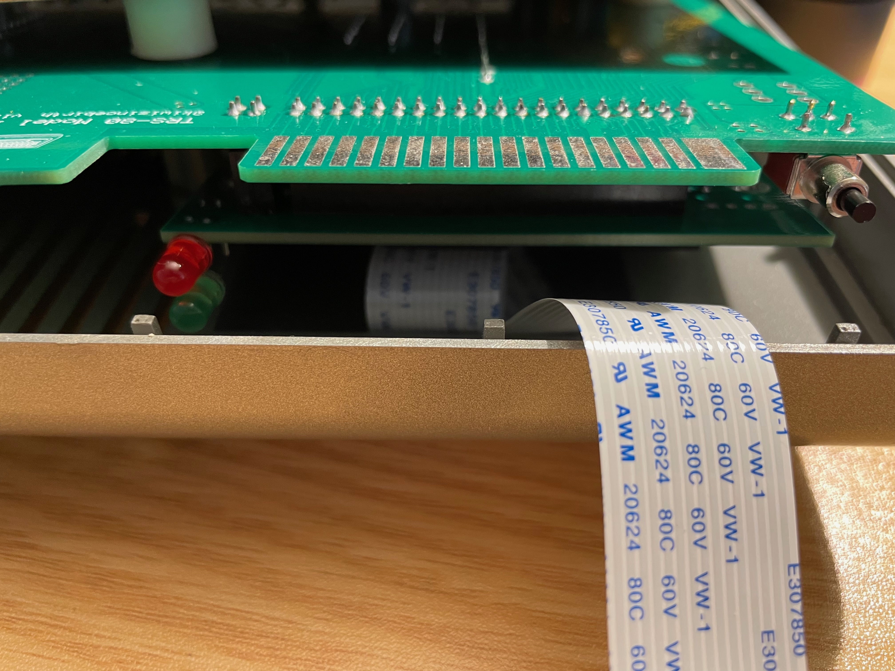

# Images

## 3D Render

## Built Board (for Model 1k)

## Running (on Model 1k)

## Installed

## Eratta

Note the images are of a pre release Prototype Board. The following was changed on these boards prior to its release.
- Silkscreen improvements. component ID's etc.
- Improved Pinout of the programming header to align with standard in circuit
    - https://onlinedocs.microchip.com/oxy/GUID-8D61C0B9-A97F-4F4D-99F8-1D7424264C2A-en-US-1/GUID-2E07C091-C3CD-4DE3-9187-80FA1E63E969.html
- Moved the programming header from under the reset switch, so reset and header are available

