# Images

## Rnders of V2b

## The Whole Board

## Closeups

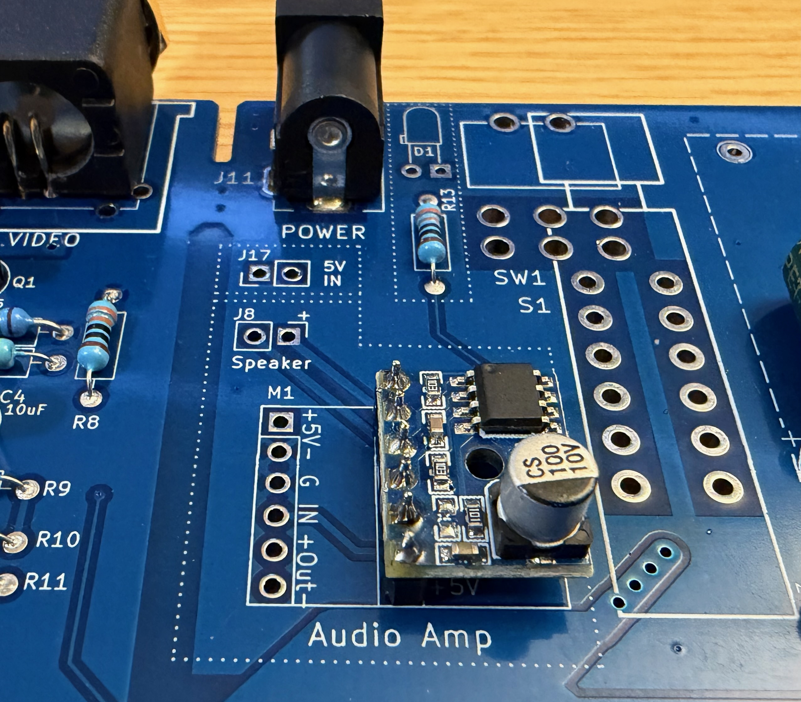

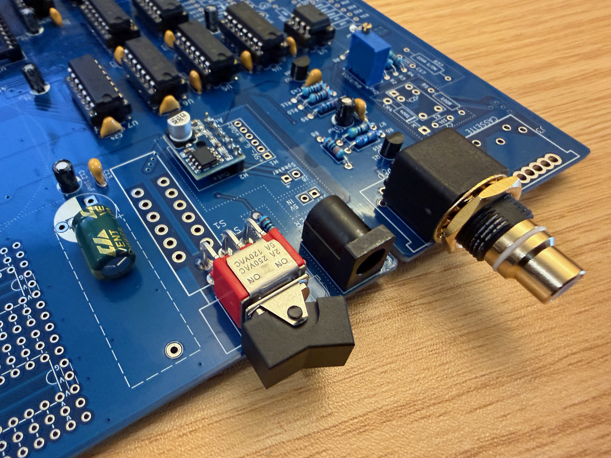

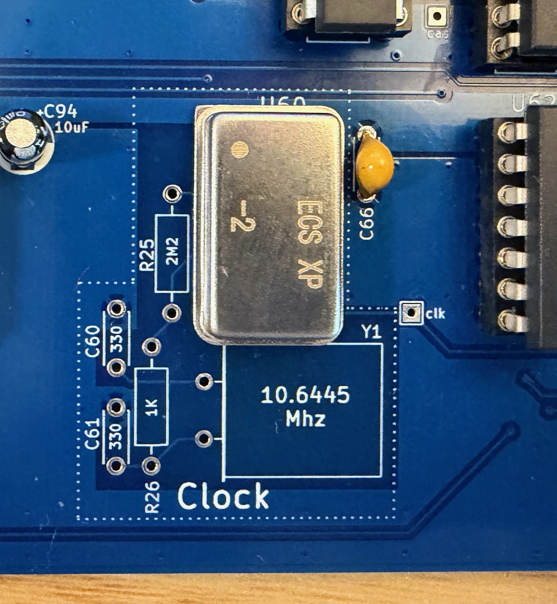

## Renders of V1d

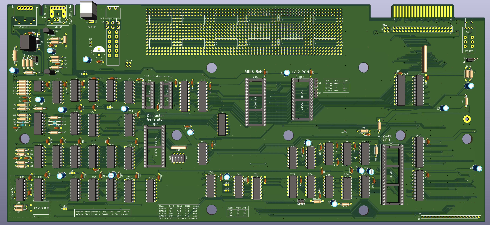

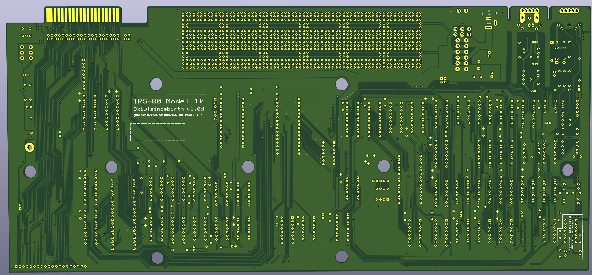

## The Whole Board

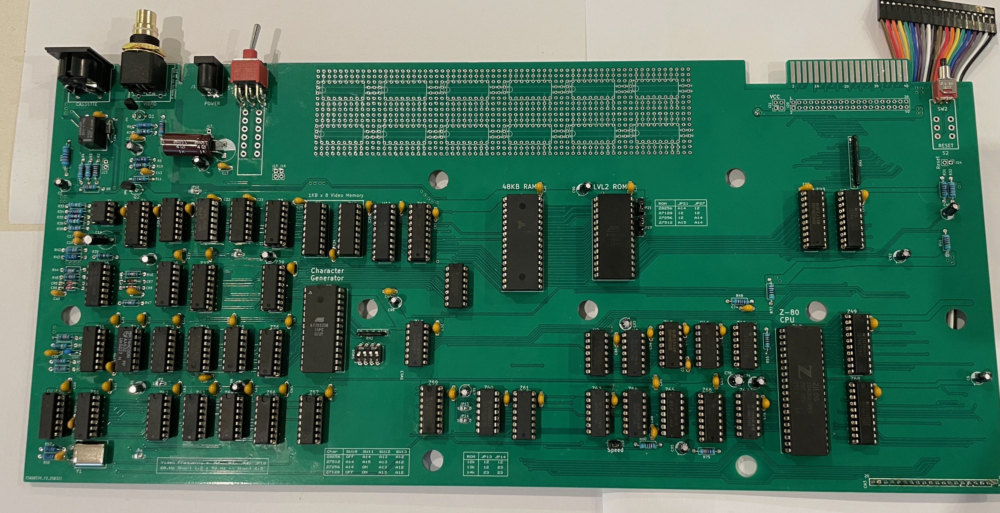

## Closeups

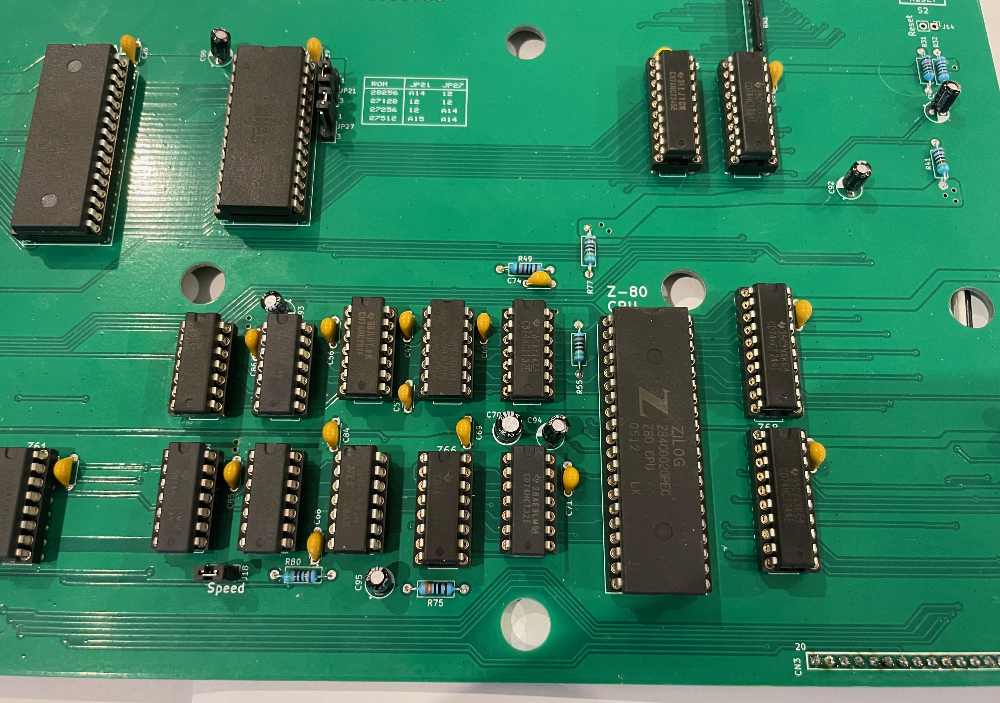

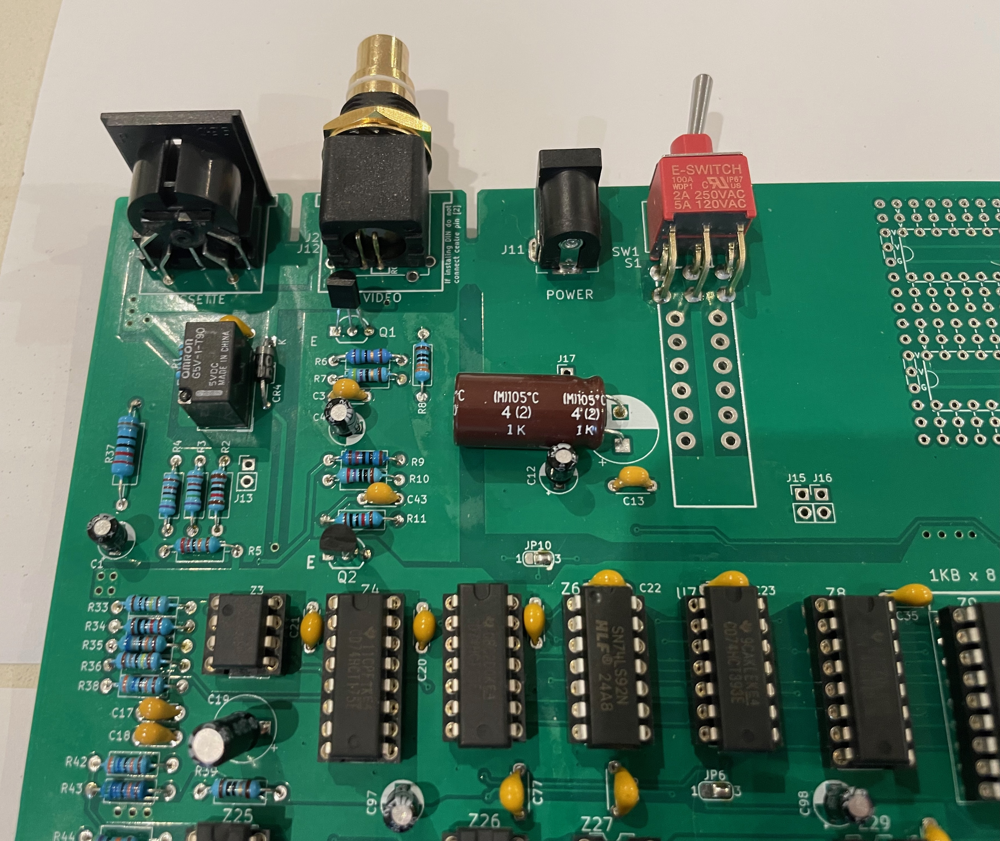

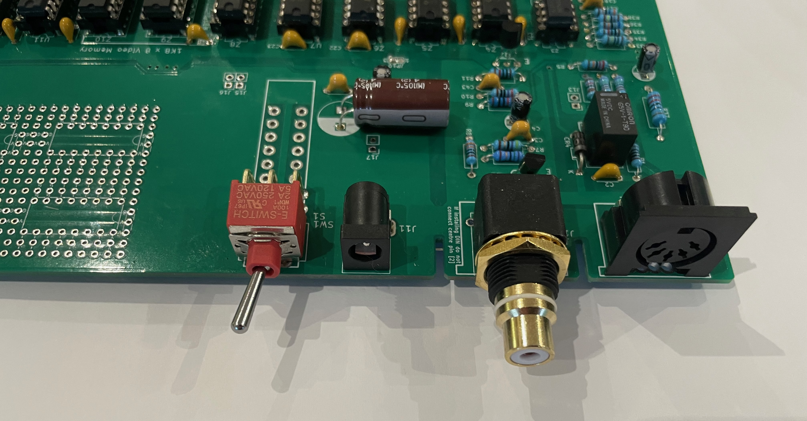

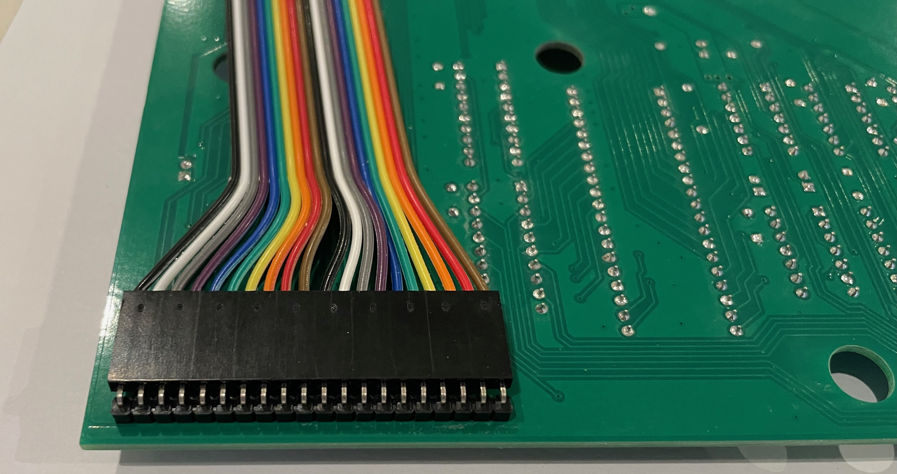

## Running 

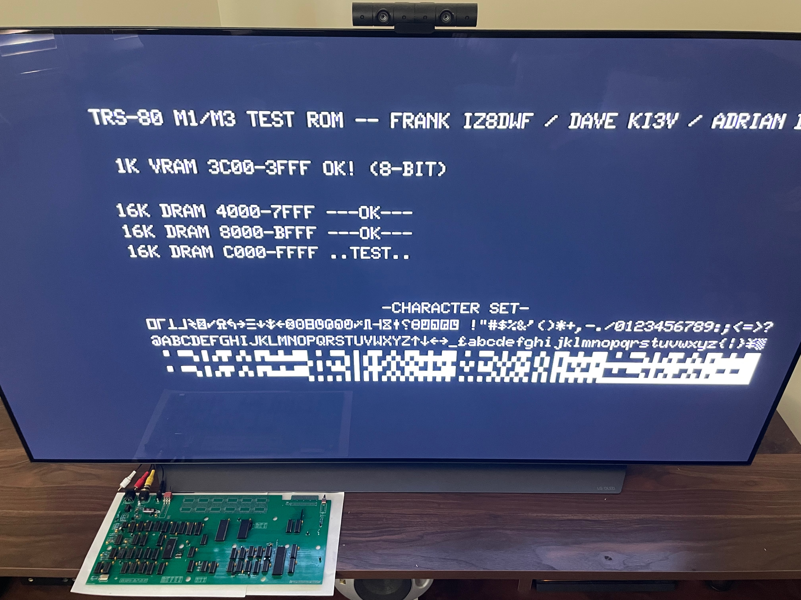

## FreHD

For Fre HD images [See Here](../frehd/images/README.md)
