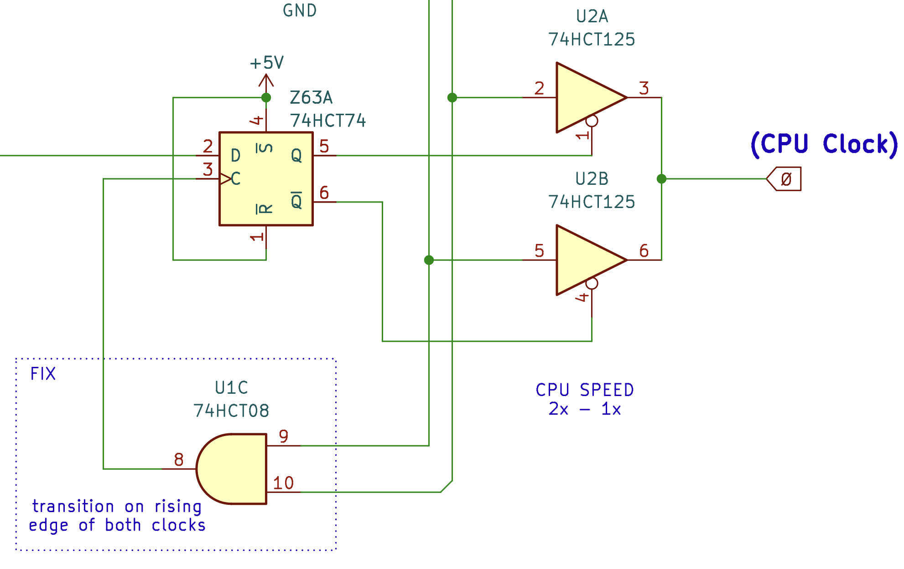
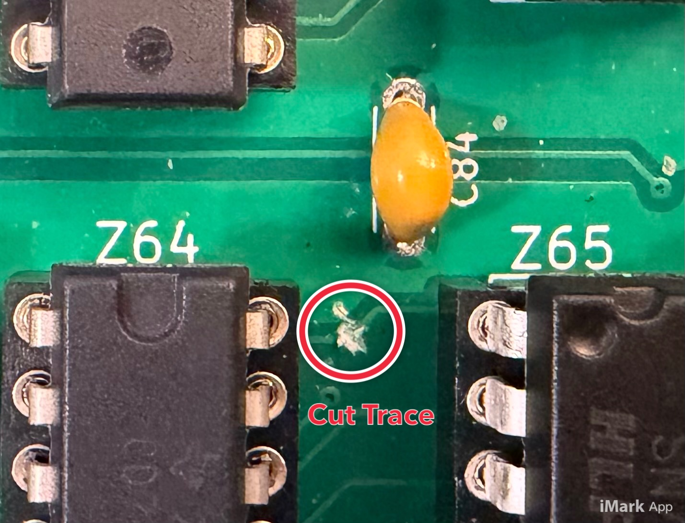
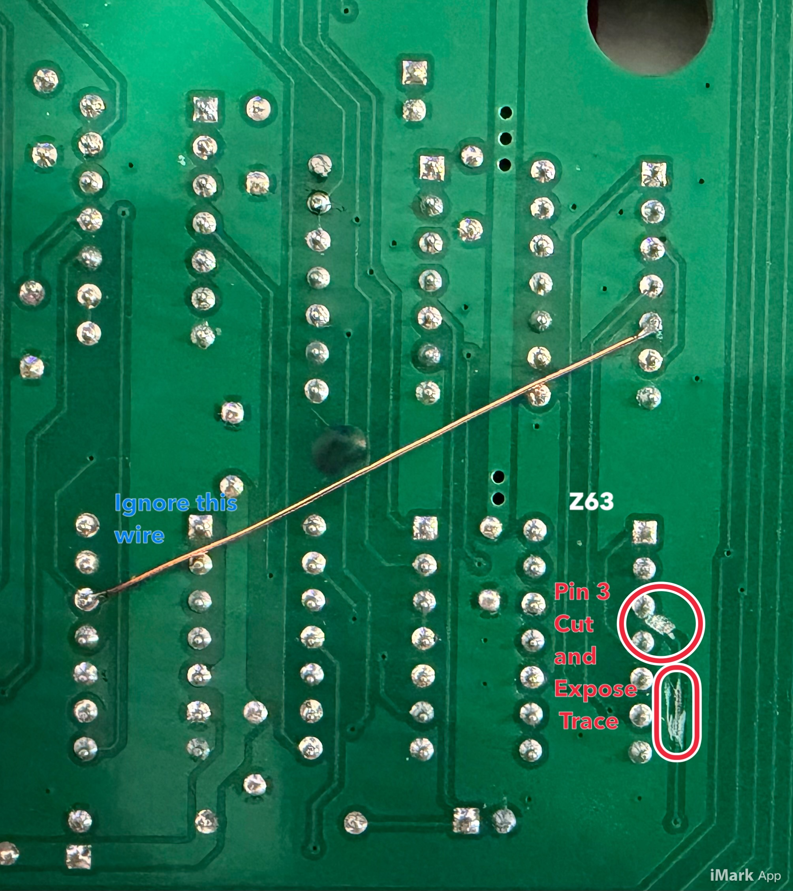
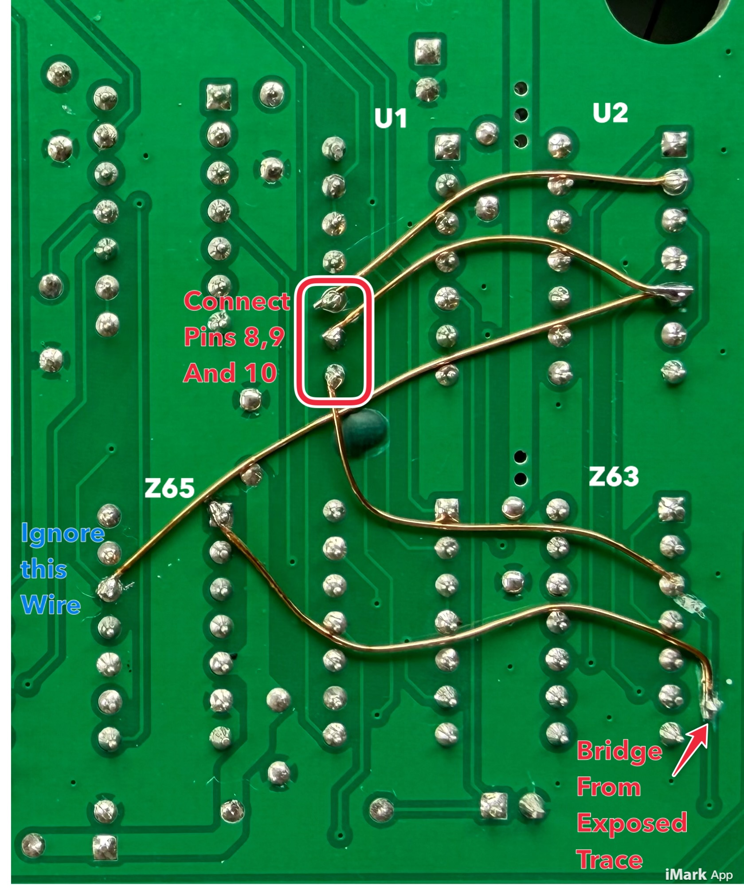

# Clock Speed (Transition)

## Issue

MSly (discord channel) has uncovered an issue when clock speed is transitioned 
from Fast <-> Slow. Sometimes the computer will lock up. 

This issue is not related to high speed itself just the transition period. This is  
problematic if using a cassette tape since the board will automatically slowed
down when the cassette drive is active. 

Diagnosing the issue it appears that the circuit that controls the transition from
one clock frequency to another is not well-timed, and can occur just after the 
current clock has transitioned, and switch to the new clock then causes another 
level transition. This resulting is a very short duration clock pulse, in the order
of 30ns. Depending on the CPU used this can be out of tolerance causing the issue.

In the above image the Green Trace is the Clock signal sent to the CPU
and the bue trace is the control signal that selects which clock signal to use.

## Options

There are a few options:
* Dont use high speed! not really an option worth discussing further.
* Use a fast CPU, which is more tolerant of high speed clock signals.
* Make a change to the board to fix the issue. Discussed Below

## Resolution

The change in the circuit requires a change to the clock input (Pin 3) on the
Flip Flop that triggers the clock signal to use. This requires the use of an
additional AND gate which there are a few unused on the board.

The circuit addresses the issue by generating a rising edge signal when both 
(using AND GATE) candidate clock signals transition to high. This rising edge 
will cause a change in flip flop output which will drive the clock selection.
Thus the transition will occur (only) when both candidate clocks are high, 
AND at the beginning of the high clock cycle itself.

## Modification

The following describes the change itself.

### For V1.0a and V1.0b Boards

Cut Trace leading into Pin 3 of Z63. Note This trace continues through Pin 3
so a second trace need to be cut and the trace reconnected bypassing Pin 3.

The first trace is on the top of the board needs to be cut

and the second trace, is on the back side of the board. The trace next to the pin
requires the solder masked to be scraped off to expose the copper beneath.

To reconnect the trace (bypassing) Z63 Pin, solder a wire from he exposed trace to Z65 Pin 1

Then we need to complete the circuit.
* U1 Pin 8 (output of AND Gate ) -> connect to Z63 Pin 3 (input Pin we disconnected)
* U1 Pin 9 (input of AND Gate) -> connect to U2 Pin 2
* U1 Pin 10 (input of AND Gate) -> connect to U2 Pin 5

The following shows the 4 connections that need to be made

### For V1.0c Boards

With V1.0c boards unused gate inputs were tied to GND (1.0a and 1.0b this wans't the case)
but unfortunately these ground connections are hard to remove, as they are on both
the bottom and top (underneath the IC) of the board.

This affects pins 9 and 10 of U1. If you have not soldered any components to the board 
then the GND connections can be cut to Pins 9 and 10 of U1 fairly easily, then you can 
use the procedure for Rev 1 A/B boards (above)

If your board is already built then there are 2 options. The simpler approach is 
to add another 74xx08 IC to the breadboard area, and solder to Pins 8,9,10 on this IC
rather than U1. Apart from that the change is identical.

A second option involves lifting Pins 8, 9, and 10 out of the U1 socket and wiring 
directly to the IC legs themselves. If doing this then might be simpler to lift 
Pin 3 of Z63 as well, then no traces need to be cut, and the rework to bypass  Pin 3 
of Z63 does not need to occur.

### On V2 motherboards

The circuit change is identical and the procedure similar excepting.
* The IC numbering was changed in V2, but the pin numbering remains the same.
* The trace leading into Pin 3 of Z63 doesn't need to be bypassed, it can simpy be cut
  as the existing trace ends at Pin 3
* Pins 9 and 10 (inputs to AND gate), can be seperated from GND plane on the bottom
  of the board, there are no connections on the top of the board

For further information contact the author, and i will expand this section.

In latter versions of the board the transition from one clock to another is based on both
clocks transitioning to High. Not this fix could easily be done to existing boards.
