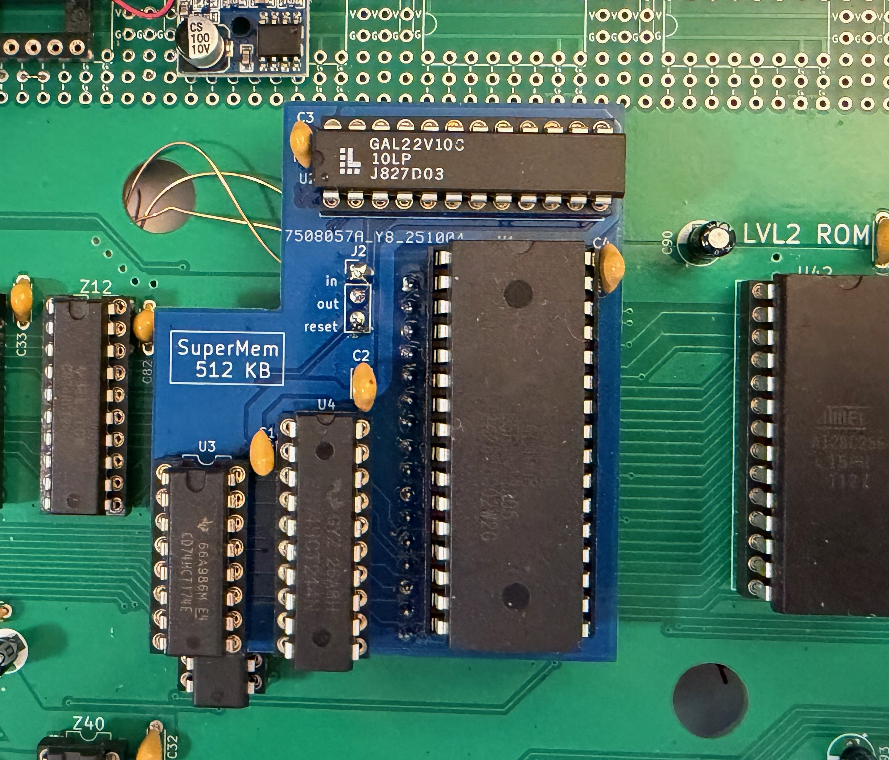
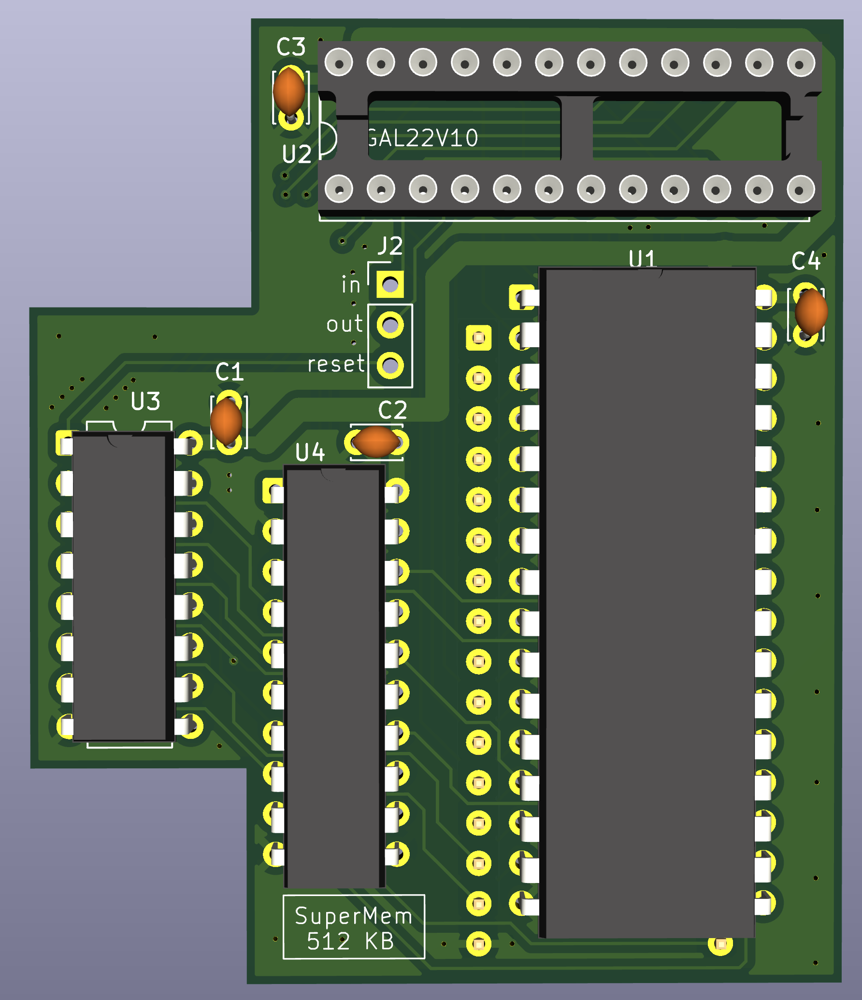
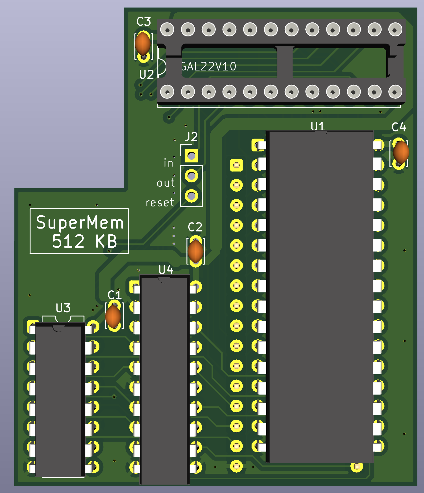

# SuperMem 512KB

## Introduction



The SuperMem board is an addition to the Model 1k that provides 512KB of Banked SRAM
(mostly) compatible with the SuperMem 512 for the Model 1

This is implemented as a small board that replaces the 128 Kbyte SRAM chip on the M1k 
main board, and contains the 512KB SRAM and the necessary bank control logic.

This board supports 15 distinct banks for upper 32KB memory, numbered 1-15. 
These banks map directly to physical pages in the actual SRAM. 
Physical page 0 is reserved for lower 16KB RAM, and cannot be mapper to upper RAM. 
Setting Bank number 0 for upper RAM, maps physical Page number 1.

| Bank Number    |        Low RAM Page |       High RAM Page |
|----------------|--------------------:|--------------------:|
| **(OUT 67,X)** | **(0000h - 7FFFh)** | **(8000h - FFFFh)** |
| 0              |                   0 |                   1 |
| 1              |                   0 |                   1 |
| 2              |                   0 |                   2 |
| 3              |                   0 |                   3 |
| ...            |                   0 |                 ... |
| 15             |                   0 |                  15 |

Setting the lower bank `OUT 67,32` (or greater) is **NOT** supported.

There are 2 board revisions, Each version is designed for each version to the M1k 
to fit around other existing components. Functionally they are the same. 
* V1 - for the Model 1k Version 1a, 1b, 1c. (all revisions) 
* V2 - for the Model 1k Version 2 

A PLC (programmable logic chip) - GAL22V10 or equivalent is required and needs to be 
programmed with the provided firmware 

Three additional wires are required to be connected from the memory board to signal's 
( IN , OUT , SYSRES ) on the main board.

## Parts

The main components required:
* Lattace GAL22V10 or equivalent programmed with the provided firmware 
* AS6C4008-55PCN 4 Mbit - 512 Kbyte RAM chip
* 74HCT174 Latch
* 74HCT244 Buffer
* 100nf Capacitors (x4)
* Pin Headers for installing in socket on Main board
* IC sockets

## Assembly Options

There are 2 overall options for assembly. Each has its own advantages. 

### Socket the components

Socket the components onto the memory board, and Solder the memory board to the main board.

This means that the board can no longer be removed, but the chips can be replaced
if any issues arise. It the SuperMem functionality needed to be disabled
the GAL would need to be reprogrammed, or replaced with jumpers that provide 
constant signals to the upper address lines.

### Socket the board

Solder the components to the memory board, and Socket the memory board onto the main board. 

This makes it easy to reverse the modification, but the components on the board 
are harder to remove. If a component fails, then probably easier to build a new board.

Note the programmable GAL **Should Always** be installed in a socket.

## Board Assembly

First solder the pin headers to the underside of the board. It is best to put the pin headers 
into a matching socket while soldering, to ensure correct alignment

Trim the pin headers on the top of the board, to allow 512KB SRAM chip (or socket) 
to be installed flush with the board itself. It may help to trim the legs prior to soldering
to achieve a flush surface

Next solder the IC's to the top of the board, using sockets only if you intend 
to solder this board to the main board. Note the GAL chip should *NOT* be soldered.

Solder the decoupling capacitors to the board.

Clean the board with isopropyl alcohol removing any flux residue.

Solder three wires to the underside of the board allowing suitable length to solder to 
the appropriate pins on the main board

Install chips into the memory board into the sockets, if not already soldered

If soldering this board to the main board, then it is **Important** to check that **ALL** soldering
on the underside of the board has been performed, once soldered to the main board it is difficult 
to correct.

## Installation

Potentially you may need to remove the decoupling capacitor from the RAM socket on the main board
to ensure the memory board has sufficient clearance.

Install the memory board to the main board, into socket, or solder as appropriate.

Route the three wires to correct signals and solder these. On V2 board there are three test points 
located just below the main ROM chip specifically for this purpose.

On V1 of the board there is no easy way to route wires to the rear of the board.
as the V1 board was never designed for this purpose. It may be easier to drill a 
small hole through board where a GND plane exists on both sides, consider just above 
and to the left of the main RAM socket.

For V1 the required signal can be obtained from:
* IN -  Z40 Pin 1
* OUT - Z40 Pin 5
* SYSRES - Z45 Pin 13

## Resources

Some useful resources:
* [Prof-80 FR SuperMem 512](https://prof-80.fr/index.php/carte-type-supermen-512k) contains original design and documentation.
* [X-MEM/80 Github Project](https://github.com/lambdamikel/x-mem-80) has some useful software for the Model 1

## Testing

Run the basic program below, which tests the basic functionality. The program
is slightly enhanced from the original BASIC test program. Also you could
use the AniTek MEMTEST/CMD program 

```
MEM SIZE ? 32000

5 POKE 32767,42
10 FOR N=0 TO 15:OUT 67,N:POKE -1,N:NEXT N 
15 FOR N=0 TO 15:PRINT N;:NEXT N:PRINT
20 FOR N=0 TO 15:OUT 67,N:PRINT PEEK(-1);:NEXT N 
25 PRINT PEEK(32767)
RUN
```

You should receive the following output

```
 0  1  2  3  4  5  6  7  8  9  10  11  12  13  14  15
 1  1  2  3  4  5  6  7  8  9  10  11  12  13  14  15  42
```

## Board Layouts

### Version 1



### Version 2




